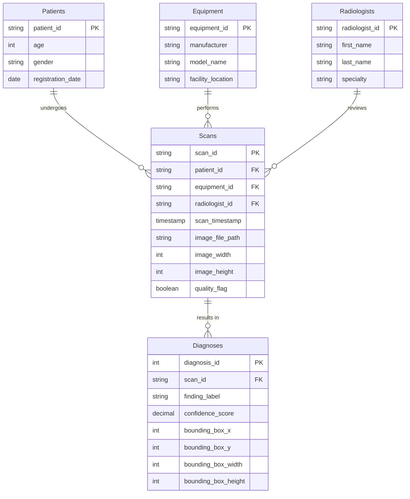

# Case Study: RadBase Cloud Analytics Architecture
**An Enterprise Data Infrastructure & Automation Pipeline**

> **Project Status:** Production Deployed  
> **Target Role Alignment:** Data Infrastructure, Systems Automation, Computer Engineer - Level I  

---

## System Architecture Overview
RadBase is an end-to-end data analytics system designed to transition isolated database operations into a modern cloud architecture. By coupling a serverless Neon PostgreSQL database with a containerized Docker runtime environment, the platform aggregates complex data structures and renders real-time performance insights. The entire system features an automated CI/CD deployment pipeline via GitHub and Render, proving a secure, scalable blueprint for modern data operations.

### The Technology Stack
*   **Database Layer:** Neon Serverless PostgreSQL Cloud Architecture
*   **Local Runtime & Virtualization:** Docker Engine running on a Linux backend (WSL2 Ubuntu)
*   **Infrastructure Hosting:** Render Cloud Platform Web Services
*   **Data Orchestration & Presentation:** Python, Streamlit UI Framework, Plotly Analytics Engines
*   **CI/CD Deployment Matrix:** GitHub Automated Version Control Hooks

---

## Infrastructure Implementation & Logic

### 1. Clinical Dataset: RSNA Pneumonia Detection Challenge
The foundational data for this pipeline is sourced from the **RSNA Pneumonia Detection Challenge** via Kaggle. This enterprise-scale clinical dataset contains complex radiographic metadata representing over 26,000 unique patient imaging records. 

The raw data is ingested via clinical CSV manifests (e.g., `stage_2_train_labels.csv`), which map unique patient IDs to binary diagnostic targets (`0` = Normal, `1` = Lung Opacity). For positive diagnoses, the dataset provides exact spatial bounding-box coordinates (`x`, `y`, `width`, `height`) used to localize the pneumatic opacities within the chest radiographs.


### 2. Database Layer & Clinical Schema (Neon PostgreSQL)
To manage the heavy data load of the Kaggle RSNA Pneumonia Detection Challenge, the data layer utilizes a serverless Neon PostgreSQL architecture. The database is strictly normalized to separate static patient demographics from the dynamic diagnostic coordinates (bounding boxes and classification targets), ensuring highly efficient, indexed queries when visualizing data in the dashboard.

### Database Entity-Relationship Diagram



### 3. Automated ETL Data Pipeline (Python & Pandas)
To populate the relational database, a custom ETL pipeline was engineered using **Python** and **Pandas**. Since the original Kaggle dataset is a flat CSV containing only patient IDs and bounding box coordinates, this script bridges the gap between raw data and a production-ready clinical backend.

**Pipeline Architecture:**
*   **Extract:** Ingests the raw clinical CSV manifest and isolates a distinct cohort of unique patient records.
*   **Transform:** Uses `pandas` and the `Faker` library to dynamically generate synthetic, HIPAA-compliant clinical metadata (patient demographics, equipment models, radiologist assignments). It perfectly normalizes the flat dataset into five distinct, relational dataframes.
*   **Load:** Utilizes `SQLAlchemy` to securely map the dataframes to the remote Neon PostgreSQL database. The script actively enforces referential integrity by loading independent tables (Patients, Equipment) before dependent tables (Scans, Diagnoses).

```python
import os
from pathlib import Path
import pandas as pd
from sqlalchemy import create_engine
from faker import Faker
import random
import uuid
from datetime import datetime, timedelta
from dotenv import load_dotenv

# ==========================================
# 1. DYNAMIC PATH CONFIGURATION
# ==========================================
BASE_DIR = Path(__file__).resolve().parent.parent
ENV_PATH = BASE_DIR / ".env"
CSV_FILE_PATH = BASE_DIR / "data" / "stage_2_train_labels.csv"

load_dotenv(dotenv_path=ENV_PATH)
DATABASE_URL = os.getenv("DATABASE_URL")

engine = create_engine(DATABASE_URL)
fake = Faker()

def run_etl():
    print("Extracting Kaggle Data...")
    df_raw = pd.read_csv(CSV_FILE_PATH)
    
    unique_patients = df_raw['patientId'].unique()[:1000]
    df_sample = df_raw[df_raw['patientId'].isin(unique_patients)].copy()
    
    print("Transforming Data: Generating Mock Clinical Metadata...")
    
    # --- 1. PATIENTS TABLE ---
    patients_data = [{'patient_id': pid, 'age': random.randint(18, 90), 'gender': random.choice(['M', 'F']), 'registration_date': fake.date_between(start_date='-5y', end_date='today')} for pid in unique_patients]
    df_patients = pd.DataFrame(patients_data)

    # --- 2. EQUIPMENT TABLE ---
    df_equipment = pd.DataFrame([
        {'equipment_id': 'EQ-001', 'manufacturer': 'Siemens', 'model_name': 'SOMATOM Drive', 'facility_location': 'North Wing'},
        {'equipment_id': 'EQ-002', 'manufacturer': 'GE Healthcare', 'model_name': 'Optima XR220', 'facility_location': 'South Wing'},
        {'equipment_id': 'EQ-003', 'manufacturer': 'Philips', 'model_name': 'DigitalDiagnost', 'facility_location': 'ER'}
    ])

    # --- 3. RADIOLOGISTS TABLE ---
    radiologists_data = [{'radiologist_id': f'RAD-{100+i}', 'first_name': fake.first_name(), 'last_name': fake.last_name(), 'specialty': 'Thoracic Radiology'} for i in range(5)]
    df_radiologists = pd.DataFrame(radiologists_data)

    # --- 4. SCANS TABLE ---
    scans_data = []
    scan_mapping = {} 
    
    for pid in unique_patients:
        scan_id = str(uuid.uuid4())
        scan_mapping[pid] = scan_id
        scans_data.append({
            'scan_id': scan_id, 'patient_id': pid, 'equipment_id': random.choice(df_equipment['equipment_id']),
            'radiologist_id': random.choice(df_radiologists['radiologist_id']),
            'scan_timestamp': fake.date_time_between(start_date='-2y', end_date='now'),
            'image_file_path': f'/images/{pid}.dcm', 'image_width': 1024, 'image_height': 1024, 'quality_flag': True
        })
    df_scans = pd.DataFrame(scans_data)

    # --- 5. DIAGNOSES TABLE ---
    diagnoses_data = []
    for index, row in df_sample.iterrows():
        label = 'Lung Opacity (Pneumonia)' if row['Target'] == 1 else 'Normal'
        diagnoses_data.append({
            'scan_id': scan_mapping[row['patientId']], 'finding_label': label, 'confidence_score': 1.0,
            'bounding_box_x': row['x'] if pd.notna(row['x']) else None, 'bounding_box_y': row['y'] if pd.notna(row['y']) else None,
            'bounding_box_width': row['width'] if pd.notna(row['width']) else None, 'bounding_box_height': row['height'] if pd.notna(row['height']) else None
        })
    df_diagnoses = pd.DataFrame(diagnoses_data)

    # ==========================================
    # 3. LOAD DATA INTO POSTGRESQL
    # ==========================================
    print("Loading data into PostgreSQL...")
    df_patients.to_sql('patients', engine, if_exists='append', index=False)
    df_equipment.to_sql('equipment', engine, if_exists='append', index=False)
    df_radiologists.to_sql('radiologists', engine, if_exists='append', index=False)
    df_scans.to_sql('scans', engine, if_exists='append', index=False)
    df_diagnoses.to_sql('diagnoses', engine, if_exists='append', index=False)
    print("Success! Data pipeline executed perfectly.")

if __name__ == "__main__":
    run_etl()
```

### 4. Containerized Runtime Environment (Docker)
To guarantee environmental parity across local development and cloud production, the entire analytical application is containerized using Docker. This approach isolates the Python runtime, the Streamlit framework, and the PostgreSQL connection drivers, completely eliminating cross-platform dependency issues.

As shown below in the local Docker environment, the application is highly optimized. The running `radbase-dashboard` container operates with minimal overhead (consuming under 50MB of memory) while successfully mapping the internal Streamlit service to local port `8501`.

<div align="center">
  
</div>

The container is constructed using a stripped-down Python image to keep the deployment package small and fast:

```dockerfile
# Production-ready environmental baseline
FROM python:3.11-slim

# Set working directory
WORKDIR /app

# Install dependencies efficiently
COPY requirements.txt .
RUN pip install --no-cache-dir -r requirements.txt

# Copy application logic
COPY . .

# Expose Streamlit default port
EXPOSE 8501

# Initialize the dashboard
CMD ["streamlit", "run", "app.py"]
```

### 5. Interactive Clinical Dashboard (Streamlit)
The presentation layer of the application is built using Python and Streamlit, serving as the user-facing command center for the clinical data. The dashboard directly queries the PostgreSQL backend to visualize the results of the ETL pipeline, providing administrators with immediate insights into operational trends and data quality.


**Key Dashboard Features:**
*   **Hardware Diagnostic Tracking:** Aggregates diagnostic outcomes by equipment manufacturer (Philips, Siemens, GE Healthcare) to monitor positivity rates and ensure hardware calibration consistency across the dataset.
*   **Staff Resource Management:** Visualizes radiologist scan volumes distributed across different hospital sectors (ER, North Wing, South Wing). This grouped metric allows administrators to track individual staff workloads and identify facility bottlenecks.
*   **ETL Pipeline Visualization:** Seamlessly translates the highly normalized SQL schema—joining the `Scans`, `Radiologists`, and `Equipment` tables—into instantly readable, high-level business intelligence charts.
*   **Quality Assurance Monitoring:** Continuously audits the database records to ensure data integrity, automatically verifying that all positive pneumonia diagnoses include valid spatial bounding box coordinates.


### 6. Cloud Deployment & CI/CD Pipeline (Render)
To make the analytics dashboard accessible to external stakeholders, the containerized application is deployed to the cloud using **Render** as a web service. 

Rather than relying on manual uploads, the system utilizes a modern Continuous Integration and Continuous Deployment (CI/CD) pipeline to manage updates. 

**The Deployment Architecture:**
*   **GitHub Integration:** The Render service is securely hooked into the repository's `main` branch. 
*   **Automated Builds:** Whenever new code, updated SQL queries, or UI changes are pushed to GitHub, Render automatically intercepts the web-hook and triggers a new build sequence.
*   **Container Reconstruction:** Render reads the repository's `Dockerfile`, pulls the `python:3.11-slim` image, installs the dependencies, and spins up the container in the cloud—guaranteeing that production behaves exactly like the local development environment.
*   **Zero-Downtime Routing:** Once the container passes health checks, Render routes the exposed `8501` port to a secure HTTPS domain.

**Live Application:** 
The live, continuously updated dashboard can be accessed here: [https://radbase-analytics.onrender.com/](https://radbase-analytics.onrender.com/)

---

### Core Technologies Used
* **Data Engineering & DB:** PostgreSQL (Neon Serverless), SQL (DDL/DML), Relational Schema Design
* **Backend & Logic:** Python 3.11, Pandas (ETL processing)
* **Frontend UI:** Streamlit
* **DevOps & Deployment:** Docker, GitHub Actions (CI/CD Hooks), Render Cloud Hosting, WSL2
* **Domain:** Healthcare Data Informatics, DICOM/Radiographic Metadata, Data QA/Integrity
