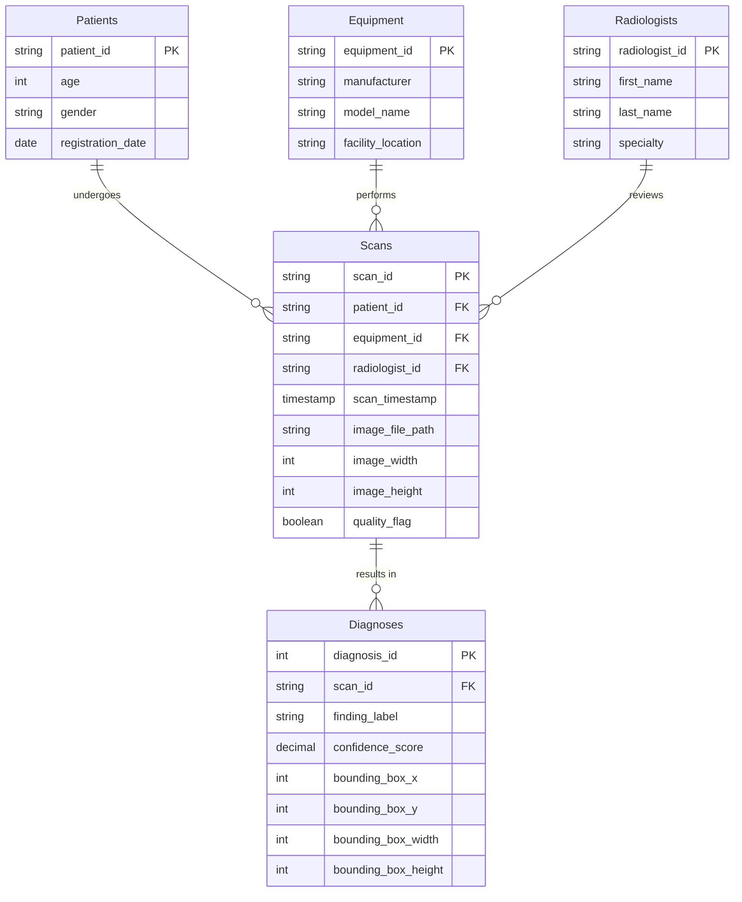

# Case Study: RadBase Cloud Analytics Architecture
**An Enterprise Data Infrastructure & Automation Pipeline**

> **Project Status:** Production Deployed  
> **Target Role Alignment:** Data Infrastructure, Systems Automation, Computer Engineer - Level I  

---

## System Architecture Overview
This project serves as a full-scale deployment case study for a containerized, cloud-hosted analytics environment. It translates local database processing workflows into a production-ready system featuring automatic database replication, strict environment boundary configurations, and zero-downtime integration pipelines.

### The Technology Stack
*   **Database Layer:** Neon Serverless PostgreSQL Cloud Architecture
*   **Local Runtime & Virtualization:** Docker Engine running on a Linux backend (WSL2 Ubuntu)
*   **Infrastructure Hosting:** Render Cloud Platform Web Services
*   **Data Orchestration & Presentation:** Python, Streamlit UI Framework, Plotly Analytics Engines
*   **CI/CD Deployment Matrix:** GitHub Automated Version Control Hooks

---

## Infrastructure Implementation & Logic

### 1. Clinical Dataset: RSNA Pneumonia Detection Challenge
The foundational data for this pipeline is sourced from the **RSNA Pneumonia Detection Challenge** via Kaggle. This enterprise-scale clinical dataset contains complex radiographic metadata representing over 26,000 unique patient imaging records. 

The raw data is ingested via clinical CSV manifests (e.g., `stage_2_train_labels.csv`), which map unique patient IDs to binary diagnostic targets (`0` = Normal, `1` = Lung Opacity). For positive diagnoses, the dataset provides exact spatial bounding-box coordinates (`x`, `y`, `width`, `height`) used to localize the pneumatic opacities within the chest radiographs.


### 2. Database Layer & Clinical Schema (Neon PostgreSQL)
To manage the heavy data load of the Kaggle RSNA Pneumonia Detection Challenge, the data layer utilizes a serverless Neon PostgreSQL architecture. The database is strictly normalized to separate static patient demographics from the dynamic diagnostic coordinates (bounding boxes and classification targets), ensuring highly efficient, indexed queries when visualizing data in the dashboard.

### Database Entity-Relationship Diagram


### 3. Containerized Runtime Environment (Docker)
To guarantee environmental parity across local development and cloud production, the entire analytical application is containerized using Docker. This approach isolates the Python runtime, the Streamlit framework, and the PostgreSQL connection drivers, completely eliminating cross-platform dependency issues.

As shown below in the local Docker environment, the application is highly optimized. The running `radbase-dashboard` container operates with minimal overhead (consuming under 50MB of memory) while successfully mapping the internal Streamlit service to local port `8501`.


The container is constructed using a stripped-down Python image to keep the deployment package small and fast:

```dockerfile
# Production-ready environmental baseline
FROM python:3.11-slim

# Set working directory
WORKDIR /app

# Install dependencies efficiently
COPY requirements.txt .
RUN pip install --no-cache-dir -r requirements.txt

# Copy application logic
COPY . .

# Expose Streamlit default port
EXPOSE 8501

# Initialize the dashboard
CMD ["streamlit", "run", "app.py"]
